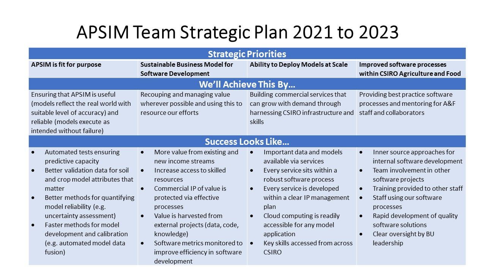

### Introducing the Digital Innovations Team

#### Objective
Partipants will have a better understanding of the software team, relevant A&F software strategy, and their role within these.

#### Background Knowledge
* working knowledge of APSIM NG or Classic
	

#### Materials/Setup
* Digital Innovations Strategic Plan

#### Key Messages

###### Who is the Digital Innovations Team
* Team members
* Key staff involved in establishing the team

###### Our Three-Year Strategy

###### Current Work Plans
* 

